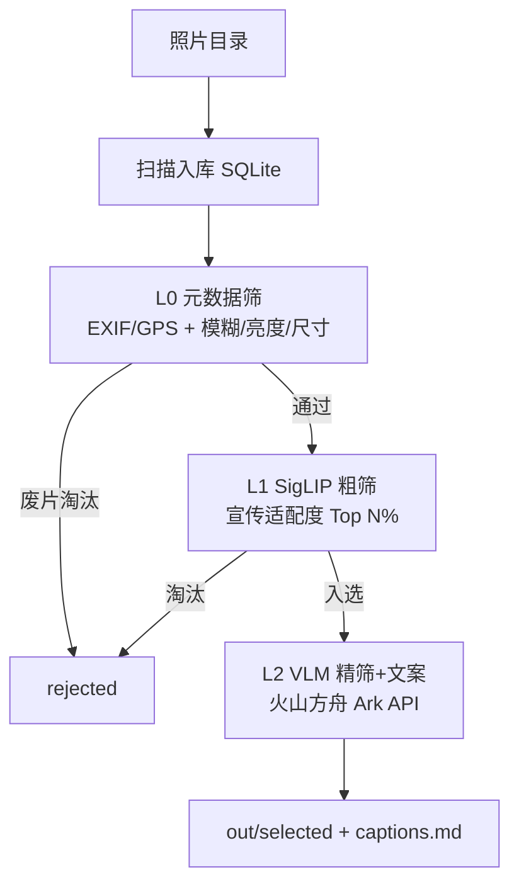

# photo-promo

从大量活动照片（几千到几万张）里，三层漏斗自动筛图并生成宣传文案。

> 🤖 Agent 上手先读 [`AGENTS.md`](./AGENTS.md) 的操作守则（通用协议在 [`docs/trio-protocol.md`](./docs/trio-protocol.md)）；改动后记得追加 [`CHANGELOG.md`](./CHANGELOG.md)（强标签格式见文件顶部）。进度走 CHANGELOG + 下方「当前接力点」。

## 当前接力点 (Handoff)

### 概述
**下一步：Phase 3 — L2 VLM 精筛+文案**。把 l1_done 的少量图发给火山方舟 Ark，一次调用同时做「是否适合宣传(带理由)」判断 + 生成含时间/位置/场景的文案，精选图复制到 `out/selected/`，文案写 `out/captions.md`。

### 明细
- **2026-06-15**：Phase 0/1/2 已完成并验证（L0 元数据筛、L1 SigLIP 粗筛跑通）。
  - Phase 3 实现点：`src/providers/ark.py` 当前 `score_and_caption` 是占位；需用 openai 库指向 Ark base_url，图转 base64 + `prompts/l2_caption.txt` 一次拿 verdict+caption。
  - `src/stage2_vlm.py` 需补：按 verdict 决定入选、复制精选图、写 captions.md（含 taken_at/location 传入 context）。
  - 依赖待加：`uv add openai`。需要 `.env` 填 `ARK_API_KEY`（用户那边确认 coding plan 能否调 API）。

## 项目简介

活动照片智能筛选系统：三层漏斗（元数据筛→SigLIP 粗筛→VLM 精筛+文案）把几万张活动照片压到几十张精选并自动配宣传文案。纯 CPU 可跑，四档硬件只改 config，SQLite 状态机支持断点续跑。

## 架构图



## 项目结构

```
photo-promo/
├── config.yaml          # 硬件档位/模型/阈值/prompt 全在这切
├── pyproject.toml       # uv 管理，promo 入口
├── 设计方案.md           # 完整背景与开发计划
├── src/
│   ├── cli.py           # promo 入口：扫描入库 → stage0/1/2 编排
│   ├── config.py        # 读 config.yaml + .env
│   ├── db.py            # SQLite 状态机（断点续跑核心）
│   ├── meta.py          # L0 纯逻辑：EXIF/GPS/逆地理编码/质量检测
│   ├── stage0_meta.py   # L0 元数据筛（已实现）
│   ├── stage1_clip.py   # L1 SigLIP 粗筛（Phase 2 待实现）
│   ├── stage2_vlm.py    # L2 VLM 精筛+文案（Phase 3 待实现）
│   └── providers/       # VLMProvider 抽象 + ark 实现
├── prompts/             # l1 粗筛 / l2 文案 prompt
├── tests/fixtures/      # 5 张样例图（_gen.py 可重建）
└── out/                 # 运行时输出（git 忽略）
```

## 子模块导航

| 路径 | 说明 |
|---|---|
| [`src/`](./src/) | 主代码：编排 + 配置 + 状态机 + 三个 stage + providers |
| [`src/providers/`](./src/providers/) | VLMProvider 抽象 + 火山方舟 Ark 实现 |
| [`prompts/`](./prompts/) | L1 粗筛 prompt / L2 精筛+文案 prompt |
| [`tests/fixtures/`](./tests/fixtures/) | 样例图，验链路用 |
| [`config.yaml`](./config.yaml) | 四档硬件/模型/阈值/prompt 配置中枢 |

## 常用操作

```bash
uv sync                              # 装依赖
cp .env.example .env                 # 填 ARK_API_KEY（L2 才需要）
uv run promo ./tests/fixtures/       # 跑流水线（断点续跑）
rm pipeline.db                       # 清状态重跑全链路
uv run python tests/fixtures/_gen.py # 重建样例图
```

## 相关链接

- 📓 演绎记录 / 进度：[CHANGELOG.md](./CHANGELOG.md)
- 🤖 Agent 守则：[AGENTS.md](./AGENTS.md)
- 📐 完整设计：[设计方案.md](./设计方案.md)
