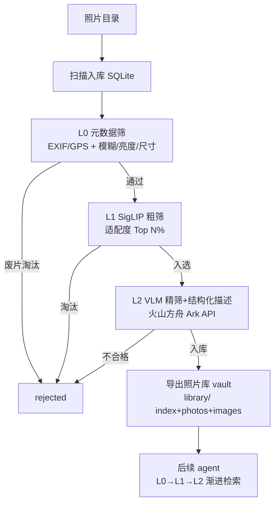

# photo-promo

从大量活动照片里三层漏斗筛出优质照片 + 结构化语义描述，建成可被后续 agent 检索的照片库。

> 🤖 Agent 上手先读 [`AGENTS.md`](./AGENTS.md) 的操作守则（通用协议在 [`docs/trio-protocol.md`](./docs/trio-protocol.md)）；**出入口对接看 [`docs/io-contract.md`](./docs/io-contract.md)**。改动后追加 [`CHANGELOG.md`](./CHANGELOG.md)。进度走 CHANGELOG + 下方「当前接力点」。

## 当前接力点 (Handoff)

### 概述
**Phase 0–4 全部完成,全链路真机验证通过**。`uv run promo <dir>` 一条命令跑通 L0→L1→L2→导出 `library/` vault。
**下一步：Phase 5（可选）evolve + 硬件适配**。对已建成 vault 做：连拍/重复去重（ADD/UPDATE/MERGE/NOOP，DELETE 只提议）、重打分、补 scene/tags、精修 `related` 互链、受控词表演化；以及 small_gpu/large_gpu/mac 硬件档位适配。

### 明细
- **2026-06-17**：Phase 4 完成并真机验证。`src/export.py` 把 l2_done 导出成 obwiki 式 vault。
  - id=内容 hash 前 12 位；原图复制进 `images/`；`related` 按同 scene + taken_at ≤30min 自动建链（带「为什么相关」）；`index.md` 是 L0 句柄表。
  - 真机验证：8 张研学连拍跑通，上午车厢组 / 下午石碑组按时间正确分簇互链（建 26 条），无跨簇误链。验证产物已清理（真实人物照片不入库）。
  - 已拍板的 `[可调]` 默认（id=hash / 复制原图 / 同 scene+时间邻近建链）待去 io-contract 标记。
- **2026-06-17**：Phase 3 完成。L2 真实接 Ark（OpenAI 兼容），一次调用拿 verdict + 结构化描述 JSON。
  - `src/providers/ark.py`：openai client 指向 Ark base_url，图转 base64 data URL，`response_format=json_object`，含围栏剥离 / 非法 JSON 兜底（标 fit=False 不入库）；无 `ARK_API_KEY` 构造即报错。
  - `src/stage2_vlm.py`：按 l1_score 降序取前 `top_n` 送 API，传 taken_at/location 进 context，按 `verdict.fit` + `require_quality_gate` 决定 l2_done / rejected。
  - **真机验证已过**（2026-06-17）：火山 key 已落 `.env`（账号 2129097397，走 `/api/v3` 按量付费，**不占 coding 订阅**）；模型 `doubao-seed-1-6-250615`。真实研学照片端到端跑通，VLM 正确读出横幅文字 + 填全 scene/tags/mood/people_count/suitable_for，入库 1 张；噪点 fixture 被精筛门槛正确淘汰。
  - 修过一个 bug：prompt 含 JSON 示例的 `{}` 被 `str.format` 误判 → 改用 `.replace` 只换 `{taken_at}`/`{location}`。
- **2026-06-15**：范围调整——**不再生成文案，改产出 obwiki 式照片库**（见 io-contract.md / 设计方案 §6）。

## 项目简介

活动照片智能筛选 + 结构化语义描述系统：三层漏斗（元数据筛→SigLIP 粗筛→VLM 精筛+描述）把几万张照片压到几十张优质图，每张配可检索的结构化语义描述，导出成 obwiki 式独立照片库供后续 agent 渐进式检索。纯 CPU 可跑，SQLite 断点续跑。

## 架构图



## 项目结构

```
photo-promo/
├── config.yaml          # 硬件档位/模型/阈值/prompt 全在这切
├── pyproject.toml       # uv 管理，promo 入口
├── 设计方案.md           # 完整背景与开发计划
├── src/
│   ├── cli.py           # promo 入口：扫描入库 → stage0/1/2 编排
│   ├── config.py        # 读 config.yaml + .env
│   ├── db.py            # SQLite 状态机（断点续跑核心）
│   ├── meta.py          # L0 纯逻辑：EXIF/GPS/逆地理编码/质量检测
│   ├── siglip.py        # L1 纯逻辑：SigLIP 打分器
│   ├── stage0_meta.py   # L0 元数据筛（已实现）
│   ├── stage1_clip.py   # L1 SigLIP 粗筛（已实现）
│   ├── stage2_vlm.py    # L2 VLM 精筛+结构化描述（已实现）
│   └── providers/       # VLMProvider 抽象 + ark 实现
├── prompts/             # l1 粗筛 / l2 描述 prompt
├── docs/io-contract.md  # 出入口契约
├── tests/fixtures/      # 5 张样例图（_gen.py 可重建）
└── library/             # 【出口】照片库 vault（Phase 4 产出，git 忽略原图）
```

## 子模块导航

| 路径 | 说明 |
|---|---|
| [`src/`](./src/) | 主代码：编排 + 配置 + 状态机 + 三个 stage + providers |
| [`src/providers/`](./src/providers/) | VLMProvider 抽象 + 火山方舟 Ark 实现 |
| [`prompts/`](./prompts/) | L1 粗筛 prompt / L2 精筛+描述 prompt |
| [`tests/fixtures/`](./tests/fixtures/) | 样例图，验链路用 |
| [`config.yaml`](./config.yaml) | 四档硬件/模型/阈值/prompt 配置中枢 |
| [`docs/io-contract.md`](./docs/io-contract.md) | **出入口契约**：照片库 vault 结构 / L0-L1-L2 / 描述 schema |

## 常用操作

```bash
uv sync                              # 装依赖
cp .env.example .env                 # 填 ARK_API_KEY（L2 才需要）
uv run promo ./tests/fixtures/       # 跑流水线（断点续跑）
rm pipeline.db                       # 清状态重跑全链路
uv run python tests/fixtures/_gen.py # 重建样例图
```

## 相关链接

- 🔌 出入口契约：[docs/io-contract.md](./docs/io-contract.md)
- 📓 演绎记录 / 进度：[CHANGELOG.md](./CHANGELOG.md)
- 🤖 Agent 守则：[AGENTS.md](./AGENTS.md)
- 📐 完整设计：[设计方案.md](./设计方案.md)（§0 范围修订 + §6 vault 设计）
