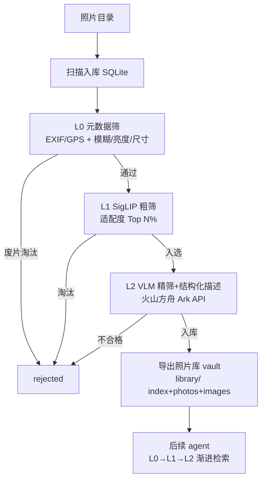

# photo-promo

从大量活动照片里三层漏斗筛出优质照片 + 结构化语义描述，建成可被后续 agent 检索的照片库。

> 🤖 Agent 上手先读 [`AGENTS.md`](./AGENTS.md) 的操作守则（通用协议在 [`docs/trio-protocol.md`](./docs/trio-protocol.md)）；**出入口对接看 [`docs/io-contract.md`](./docs/io-contract.md)**。改动后追加 [`CHANGELOG.md`](./CHANGELOG.md)。进度走 CHANGELOG + 下方「当前接力点」。

## 当前接力点 (Handoff)

### 概述
**下一步：Phase 3 — L2 VLM 精筛 + 结构化语义描述**。把 l1_done 的少量图发给火山方舟 Ark，一次调用同时做「是否适合入库(带理由)」判断 + 输出结构化语义描述 JSON（场景/主体/标签/氛围/人数…），写入 SQLite。
**⚠ 依赖出入口契约**：实现前先按 [`docs/io-contract.md`](./docs/io-contract.md) §3.3 的描述 schema 来；其中标 `[可调]` 的字段待 James 拍板。

### 明细
- **2026-06-15**：范围调整——**不再生成文案，改产出 obwiki 式照片库**（见 io-contract.md / 设计方案 §6）。Phase 0/1/2 实现不受影响（L0/L1 照旧）。
  - Phase 3 实现点：`src/providers/ark.py` 的 `score_and_caption` → 改为 `score_and_describe`，用 openai 库指向 Ark base_url，图转 base64 + `prompts/l2_describe.txt` 一次拿 verdict + 结构化描述。
  - `src/stage2_vlm.py`：按 verdict 决定入库，描述写 DB（taken_at/location 传入 context）。
  - Phase 4 才做 `library/` vault 导出（index.md + photos/ + images/ + 互链）。
  - 依赖待加：`uv add openai`。需 `.env` 填 `ARK_API_KEY`。
  - 已就位：`prompts/l2_describe.txt`（描述 prompt）、db `description` 字段、provider 接口 `score_and_describe`、config `require_quality_gate`。

## 项目简介

活动照片智能筛选 + 结构化语义描述系统：三层漏斗（元数据筛→SigLIP 粗筛→VLM 精筛+描述）把几万张照片压到几十张优质图，每张配可检索的结构化语义描述，导出成 obwiki 式独立照片库供后续 agent 渐进式检索。纯 CPU 可跑，SQLite 断点续跑。

## 架构图



## 项目结构

```
photo-promo/
├── config.yaml          # 硬件档位/模型/阈值/prompt 全在这切
├── pyproject.toml       # uv 管理，promo 入口
├── 设计方案.md           # 完整背景与开发计划
├── src/
│   ├── cli.py           # promo 入口：扫描入库 → stage0/1/2 编排
│   ├── config.py        # 读 config.yaml + .env
│   ├── db.py            # SQLite 状态机（断点续跑核心）
│   ├── meta.py          # L0 纯逻辑：EXIF/GPS/逆地理编码/质量检测
│   ├── siglip.py        # L1 纯逻辑：SigLIP 打分器
│   ├── stage0_meta.py   # L0 元数据筛（已实现）
│   ├── stage1_clip.py   # L1 SigLIP 粗筛（已实现）
│   ├── stage2_vlm.py    # L2 VLM 精筛+结构化描述（Phase 3 待实现）
│   └── providers/       # VLMProvider 抽象 + ark 实现
├── prompts/             # l1 粗筛 / l2 描述 prompt
├── docs/io-contract.md  # 出入口契约
├── tests/fixtures/      # 5 张样例图（_gen.py 可重建）
└── library/             # 【出口】照片库 vault（Phase 4 产出，git 忽略原图）
```

## 子模块导航

| 路径 | 说明 |
|---|---|
| [`src/`](./src/) | 主代码：编排 + 配置 + 状态机 + 三个 stage + providers |
| [`src/providers/`](./src/providers/) | VLMProvider 抽象 + 火山方舟 Ark 实现 |
| [`prompts/`](./prompts/) | L1 粗筛 prompt / L2 精筛+描述 prompt |
| [`tests/fixtures/`](./tests/fixtures/) | 样例图，验链路用 |
| [`config.yaml`](./config.yaml) | 四档硬件/模型/阈值/prompt 配置中枢 |
| [`docs/io-contract.md`](./docs/io-contract.md) | **出入口契约**：照片库 vault 结构 / L0-L1-L2 / 描述 schema |

## 常用操作

```bash
uv sync                              # 装依赖
cp .env.example .env                 # 填 ARK_API_KEY（L2 才需要）
uv run promo ./tests/fixtures/       # 跑流水线（断点续跑）
rm pipeline.db                       # 清状态重跑全链路
uv run python tests/fixtures/_gen.py # 重建样例图
```

## 相关链接

- 🔌 出入口契约：[docs/io-contract.md](./docs/io-contract.md)
- 📓 演绎记录 / 进度：[CHANGELOG.md](./CHANGELOG.md)
- 🤖 Agent 守则：[AGENTS.md](./AGENTS.md)
- 📐 完整设计：[设计方案.md](./设计方案.md)（§0 范围修订 + §6 vault 设计）
